# 🚀 Space Story Project

## Overview

Space Story Project is an interactive space-themed storytelling web application built with HTML, CSS, and JavaScript. Users make choices that influence the storyline and lead to different endings.

The application is hosted on AWS using Amazon S3 and Amazon CloudFront, with deployments automated through GitHub Actions. This project demonstrates frontend development, cloud hosting, and CI/CD automation.

---

## Project Objectives

* Build an interactive storytelling web application.
* Host the website on AWS.
* Automate deployments with GitHub Actions.
* Deliver content securely through CloudFront and HTTPS.
* Gain hands-on experience with cloud and CI/CD technologies.

---

# Architecture Diagram

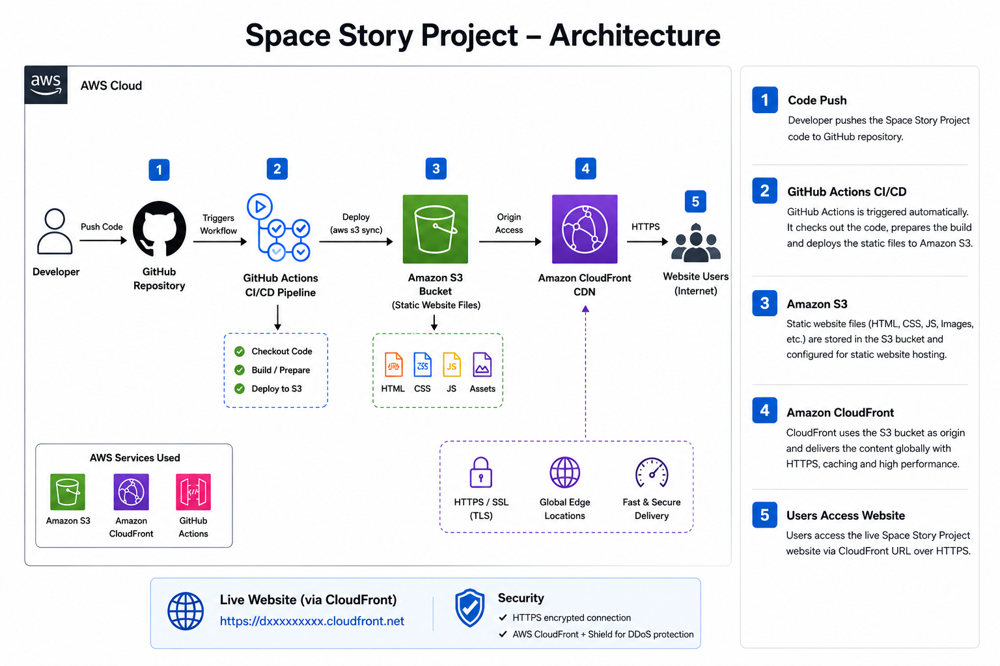

### Architecture Description

- The developer pushes code changes to the GitHub repository.
- GitHub Actions automatically triggers the CI/CD workflow on every push to the main branch.
- The workflow deploys the website files (HTML, CSS, JavaScript, and assets) to Amazon S3.
- Amazon S3 stores and hosts the static website content.
- Amazon CloudFront uses the S3 bucket as its origin and delivers the website globally through HTTPS, providing secure and high-performance access to users.

# Project Implementation

## Step 1: Developing the Website

The Space Story Project was developed using HTML, CSS, and JavaScript to create an interactive space-themed storytelling experience. Users make choices throughout the story, leading to different paths and endings.

### GitHub Repository

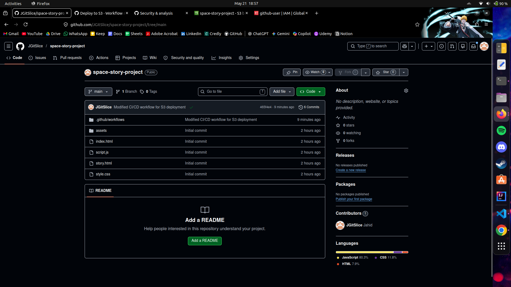

The project source code was uploaded to GitHub for version control and deployment management.

## Step 2: Configuring Amazon S3 Static Website Hosting

Amazon S3 Static Website Hosting was enabled to host the website files on AWS. The index document was configured to allow users to access the website through the S3 website endpoint.

### Amazon S3 Static Website Hosting

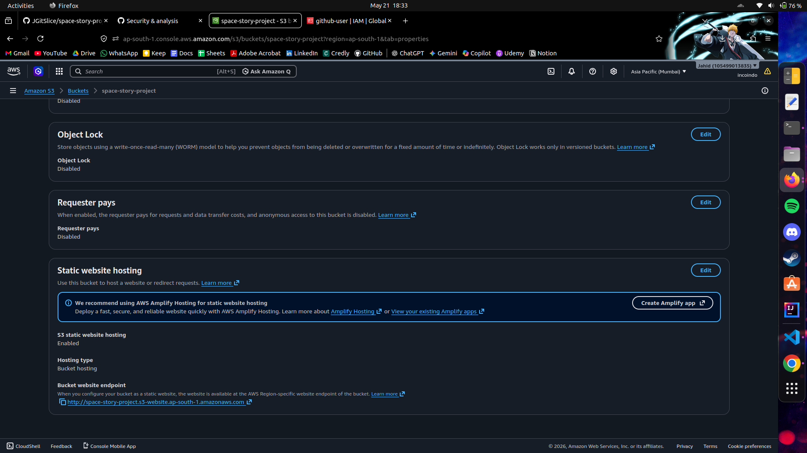

The S3 bucket was configured to serve the Space Story Project as a static website.

## Step 3: Uploading Website Files to Amazon S3

After configuring static website hosting, the website files were uploaded to the Amazon S3 bucket. These files include the HTML pages, CSS stylesheets, JavaScript files, and other project assets.

### Amazon S3 Bucket

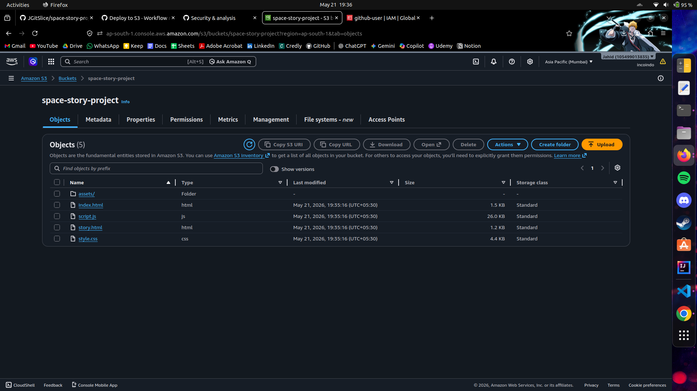

The S3 bucket stores all website files required to host the Space Story Project.

## Step 4: Implementing CI/CD with GitHub Actions

To automate deployments, a GitHub Actions workflow was configured. Whenever changes are pushed to the main branch, the workflow automatically deploys the latest website files to Amazon S3.

### GitHub Actions Workflow

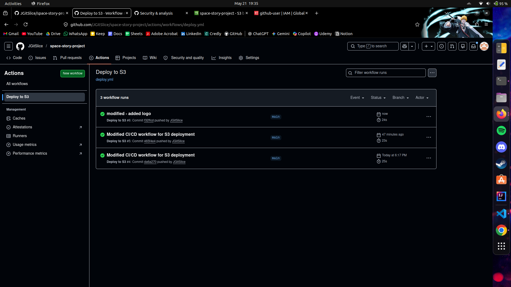

The CI/CD pipeline eliminates manual deployments and ensures that the live website is automatically updated with every code change.

## Step 5: Configuring Amazon CloudFront

Amazon CloudFront was configured to improve website performance and provide secure access through HTTPS. The S3 bucket was used as the origin for the CloudFront distribution.

### Amazon CloudFront Distribution

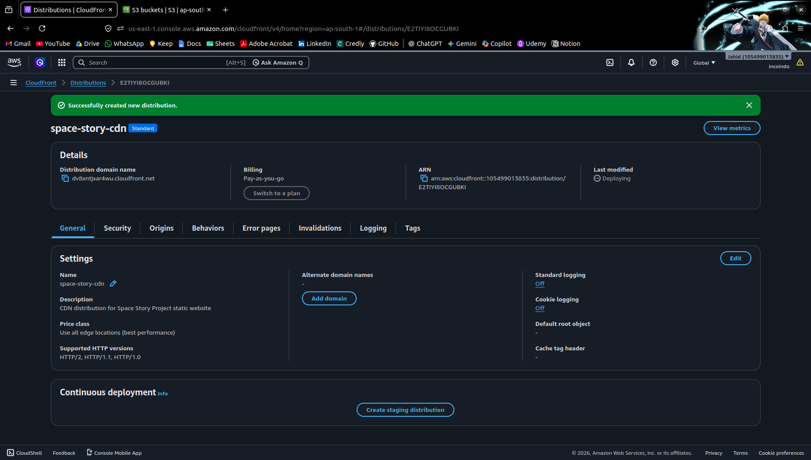

CloudFront delivers the website content through AWS edge locations, improving performance and ensuring secure access for users worldwide.

## Step 6: Verifying the Deployment

After configuring Amazon S3, GitHub Actions, and Amazon CloudFront, the website was successfully deployed and made accessible through the CloudFront distribution URL.

### Home Page

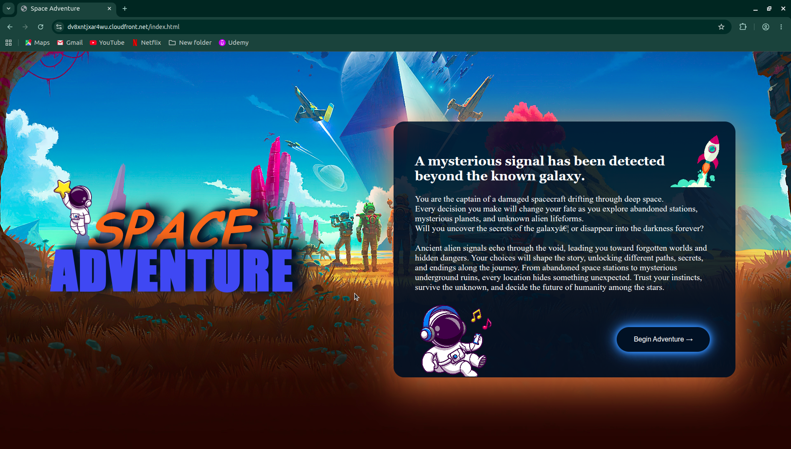

The landing page introduces users to the Space Story Project and allows them to begin their adventure.

### Interactive Story Experience

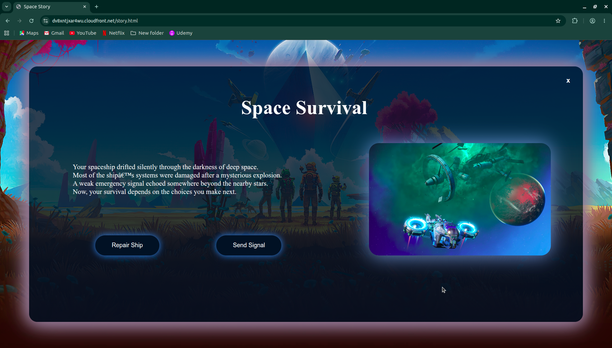

Users are presented with different story scenarios and choices that influence the progression of the adventure.

### Alternative Story Path

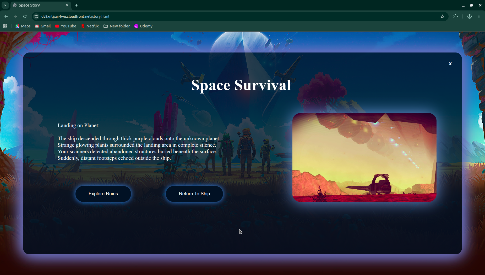

Different choices lead users through unique story paths, creating an interactive experience.

### Secret Ending

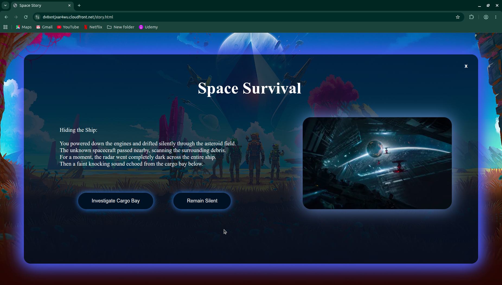

The project includes multiple endings, including special outcomes based on user decisions.

### Game Over Screen

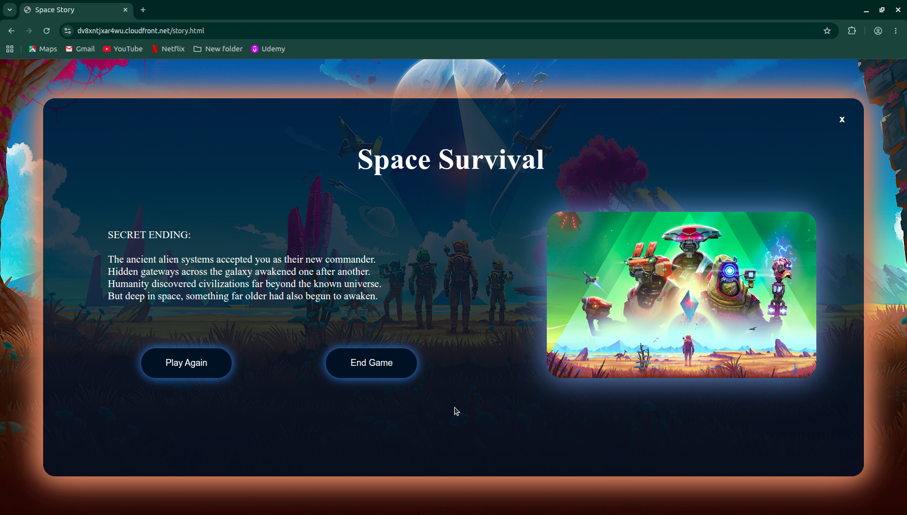

Certain choices can result in a game-over scenario, encouraging users to replay and explore different outcomes.

### Additional Story Path

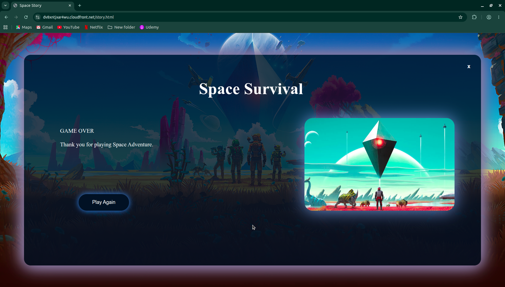

The website provides multiple branching paths, increasing user engagement and replayability.

# Project Outcome

The Space Story Project was successfully developed and deployed using AWS cloud services and DevOps practices.

### Achievements

* Built an interactive space-themed web application.
* Hosted the website on Amazon S3.
* Automated deployments using GitHub Actions.
* Configured Amazon CloudFront for HTTPS and global content delivery.
* Gained hands-on experience with cloud computing and deployment automation.
